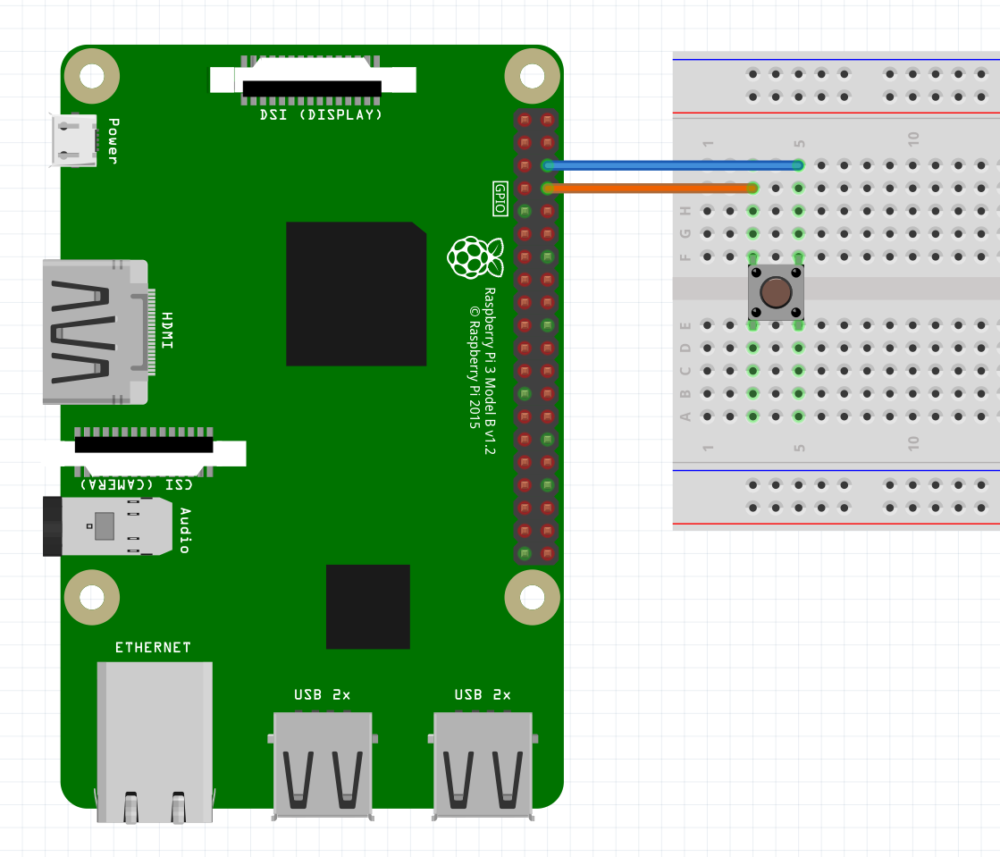
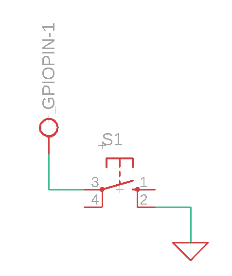

# Button 

The button is connected between a ground (GND) and any GPIO pin. The class sets the given GPIO pin to an input with an pull up resistor meaning: there will be an internal resistor connected between 3.3V and the GPIO pin.

 

## Usage

To use the class, you first need to make an object with the class. The construction method takes one parameter: the GPIO pin number that the button is connected to.
This can be done  the following way:

```python
objectName = button(pinNumber)
```

If the object is succesfulle created, the given pin needs to be initialized. This can be either done manually or automatically. There is a buildin function:

```python
objectName.setup()
```

At last, the interrupt function must be initialized. This can be done with the following function:

```python
objectName.setupInterrupt(function)
```

The function provided for the interrupt must have one parameter: channel. When the function is called by the interrupt, this parameter will be the pin number that the interrupt occured on.

```python
def function(channel):
    print("Button pressed!")
```

## Example script

```python
import time
import signal
import sys

import RPi.GPIO as GPIO

class button:
    # constructor for the button, takes the pin number as an argument
    def __init__(self, pin):
        self.pin = pin
        GPIO.setup(self.pin, GPIO.IN, pull_up_down=GPIO.PUD_UP)

    # setup the interrupt for the button, takes the function to be called as an argument
    def setupInterrupt(self, interruptFunction):
        GPIO.add_event_detect(self.pin, GPIO.FALLING, callback=interruptFunction, bouncetime=30)

    # cleanup the GPIO pins
    def cleanup(self):
        GPIO.cleanup()


def buttonFunction(channel):
    print("Button pressed!  ", end="")
    print(time.strftime("%H:%M:%S"))
    print(channel)

def signal_handler(sig, frame):
    GPIO.cleanup()
    sys.exit(0)

if __name__ == "__main__":
    GPIO.setmode(GPIO.BCM)
    button1 = button(21)
    button1.setup()
    button1.setupInterrupt(buttonFunction)

    signal.signal(signal.SIGINT, signal_handler)
    signal.pause()
```