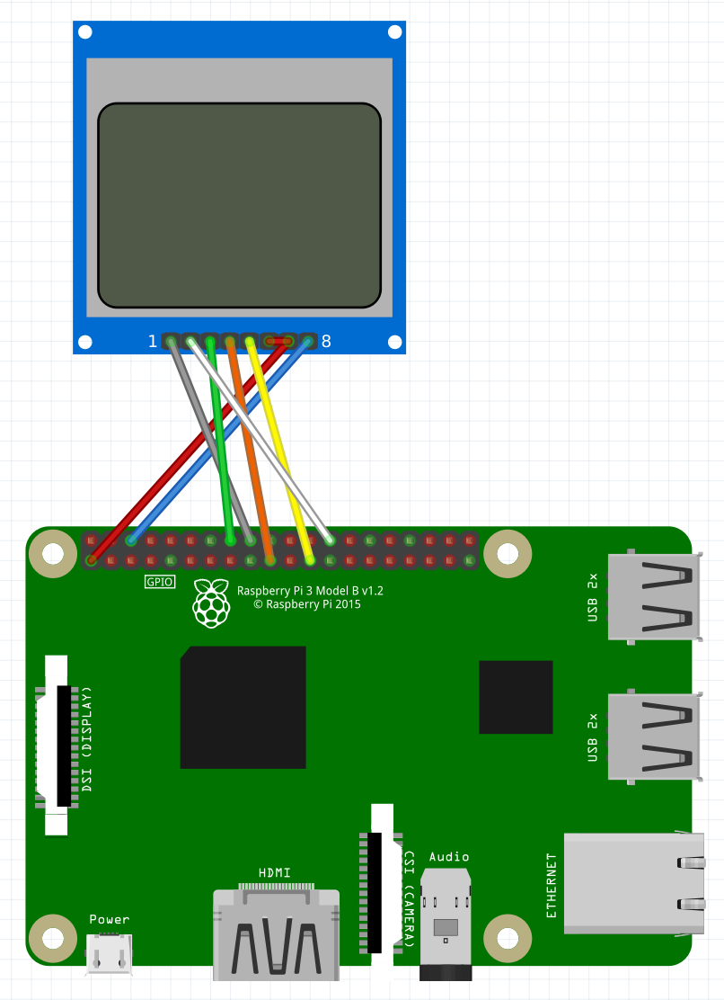
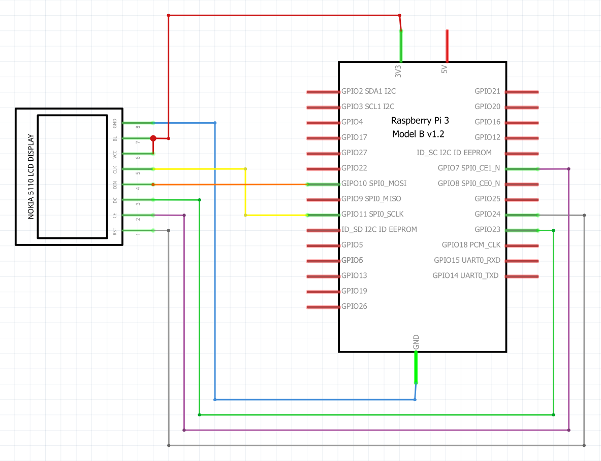

# Lcd Screen

This class is written for a blue NoKia 5110 lcd screen. This lcd screen needs five input pins, as well as 3.3V and GND. In the schema's down below, the connections are shown. The needed connections are:

<table>
    <tr>
        <th>LCD</th>
        <th>Pin number</th>        
        <th>RPI</th>
        <th>Pin number</th>
    </tr>
    <tr>
        <td>Reset</td>
        <td>1</td>
        <td>GPIO24</td>
        <td>18</td>
    </tr>    
    <tr>
        <td>Chip Enable</td>
        <td>2</td>
        <td>CE1</td>
        <td>26</td>
    </tr>
    <tr>
        <td>Data/Command</td>
        <td>3</td>
        <td>GPIO23</td>
        <td>16</td>
    </tr>
    <tr>
        <td>Data In</td>
        <td>4</td>
        <td>Mosi</td>
        <td>19</td>
    </tr>
    <tr>
        <td>Clock</td>
        <td>5</td>
        <td>SCLK</td>
        <td>23</td>
    </tr>
    <tr>
        <td>VCC</td>
        <td>6</td>
        <td>3.3V</td>
        <td>1</td>
    </tr>
    <tr>
        <td>Backlight</td>
        <td>7</td>
        <td>3.3V</td>
        <td>1</td>
    </tr>    
    <tr>
        <td>Ground</td>
        <td>8</td>
        <td>Ground</td>
        <td>6</td>
    </tr>
</table>

 

## Usage


To use the class, you first need to make an object with the class. The construction method takes one parameter: the GPIO pin number that the relay is connected to.
This can be done  the following way:

```python
objectName = lcdScreen()
```

To push text to the display, the method setText is used. This method requires one parameter:

```python
objectName.setText(text)
```

The 'text' parameter must be a string array of 5 elements.

```python
text = ["Line 1",
        "Line 2",
        "Line 3",
        "Line 4",
        "Line 5"]
```

Every time a new text is displayed, the complete screen needs to be cleared. The method clearDisplay does exacly that. The method doesnt have to be called everytime new text is displayed, it is implemented in the setText method.

```python
objectName.clearDisplay()
```

## Example script
```python
import time
import busio
import digitalio
import board
import adafruit_pcd8544
from PIL import Image
from PIL import ImageDraw
from PIL import ImageFont

class lcdScreen:
    # constructor
    def __init__(self):

        # Initialize SPI bus
        spi = busio.SPI(board.SCK, MOSI=board.MOSI, MISO=board.MISO)

        # Initialize display
        dc = digitalio.DigitalInOut(board.D23)  # data/command
        cs1 = digitalio.DigitalInOut(board.CE1)  # chip select CE1 for display
        reset = digitalio.DigitalInOut(board.D24)  # reset
        self.display = adafruit_pcd8544.PCD8544(spi, dc, cs1, reset, baudrate= 1000000)
        self.display.bias = 4
        self.display.contrast = 60
        self.display.invert = True
        
        #  Clear the display.  Always call show after changing pixels to make the display update visible!
        self.display.fill(0)
        self.display.show()

        # Load default font.
        self.font = ImageFont.load_default()
        #font=ImageFont.truetype("/usr/share/fonts/truetype/freefont/FreeSansBold.ttf", 10)

        # Get drawing object to draw on image
        self.image = Image.new('1', (self.display.width, self.display.height)) 
        draw = ImageDraw.Draw(self.image)

        # Draw a white filled box to clear the image.
        draw.rectangle((0, 0, self.display.width, self.display.height), outline=255, fill=255)

    # set the text to display
    def setText(self, textArray):
        self.clearDisplay()
        draw = ImageDraw.Draw(self.image)
        for i in range(len(textArray)):
            draw.text((1, i*8), textArray[i], font=self.font)
        self.display.image(self.image)
        self.display.show()
    
    # set an image on the display, takes a path to the image
    def setImage(self, imagePath):
        self.clearDisplay()
        image = Image.open(imagePath).resize((self.display.width, self.display.height), Image.ANTIALIAS).convert('1')

        self.display.image(image)
        self.display.show()

    # clear display
    def clearDisplay(self):
        draw = ImageDraw.Draw(self.image)
        draw.rectangle((0, 0, self.display.width, self.display.height), outline=255, fill=255)
        self.display.image(self.image)
        self.display.show()


if __name__ == "__main__":
    lcd = lcdScreen()

    text = ["Hello World!", 
    "Hello World!", 
    "Hello World!", 
    "Hello World!", 
    "Hello World!"]
    lcd.setText(text)

    time.sleep(1)

    text[1] = "text changed"
    text[2] = "this is a test"
    lcd.setText(text)
    time.sleep(1)

    lcd.clearDisplay()
```