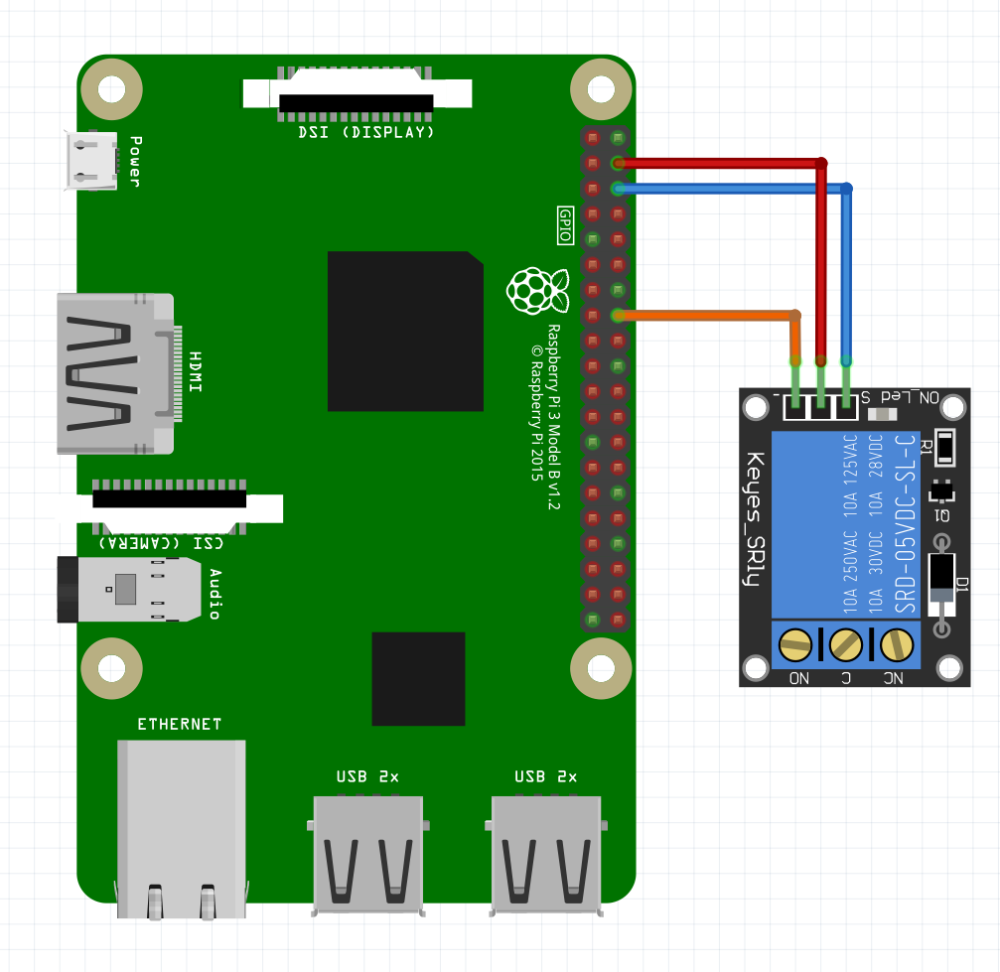
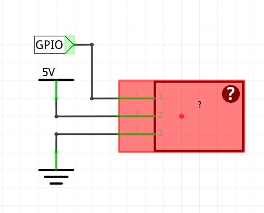

# Relay

The relay module is connected to the raspberry pi through a GPIO pin. The VCC and GND are, of course, connected to the 5V and the ground

 

## Usage


To use the class, you first need to make an object with the class. The construction method takes one parameter: the GPIO pin number that the relay is connected to.
This can be done  the following way:

```python
objectName = relay(pinNumber)
```

If the object is made, you can start to use the methods of the class. To set the state of the relay pin, the following method is used.

```python
objectName.setStatus(status)
```

Aside from setting the state, there is also a way to toggle it:

```python
objectName.toggleStatus()
```

When exiting the program, it is suggested to cleanup the gpio. There is an extra method (aside from the GPIO.cleanup() method) that sets the relay to its 'off' state and frees the GPIO pin.

```python
objectName.cleanUp()
```

## Example script
```python
import time

import RPi.GPIO as GPIO

class relay:
    status = 1
    manual = 0

    # Constructor, takes a pin number that is connected to the relay
    def __init__(self, pin):
        self.pin = pin
        GPIO.setup(self.pin, GPIO.OUT)
        GPIO.output(self.pin, 1)
    
    # setter, sets the status of the relay and turns it on or off
    def setStatus(self, status):
        if status == 0:
            self.status = 1
        elif status == 1:
            self.status = 0
        GPIO.output(self.pin, self.status)
    
    # toggle the status of the relay and turns it on or off
    def toggleStatus(self):
        if self.status == 0:
            self.status = 1
        elif self.status == 1:
            self.status = 0
        GPIO.output(self.pin, self.status)

    # getter, returns the status of the relay
    def getStatus(self):
        self.status = GPIO.input(self.pin)
        if self.status == False:
            return 1
        else:
            return 0

    # setter, sets the manual status of the relay which is used by the phone controller
    def setManual(self, status):
        self.manual = status

    # getter, returns the manual status of the relay
    def getManual(self):
        return self.manual

    def cleanUp(self):
        GPIO.output(self.pin, True)

if __name__ == "__main__":
    GPIO.setmode(GPIO.BCM)
    light = relay(26)

    try:
        while True:
            light.toggleStatus()
            time.sleep(1)
    except KeyboardInterrupt:
        light.cleanUp()
```