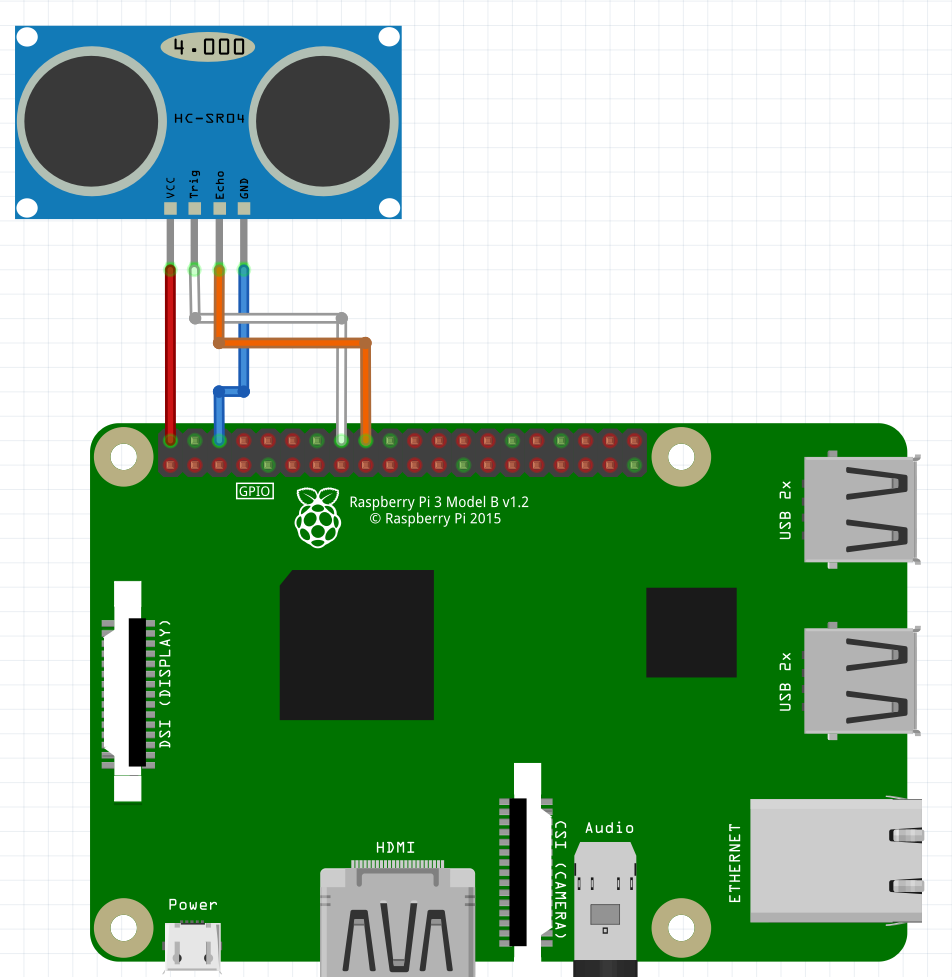
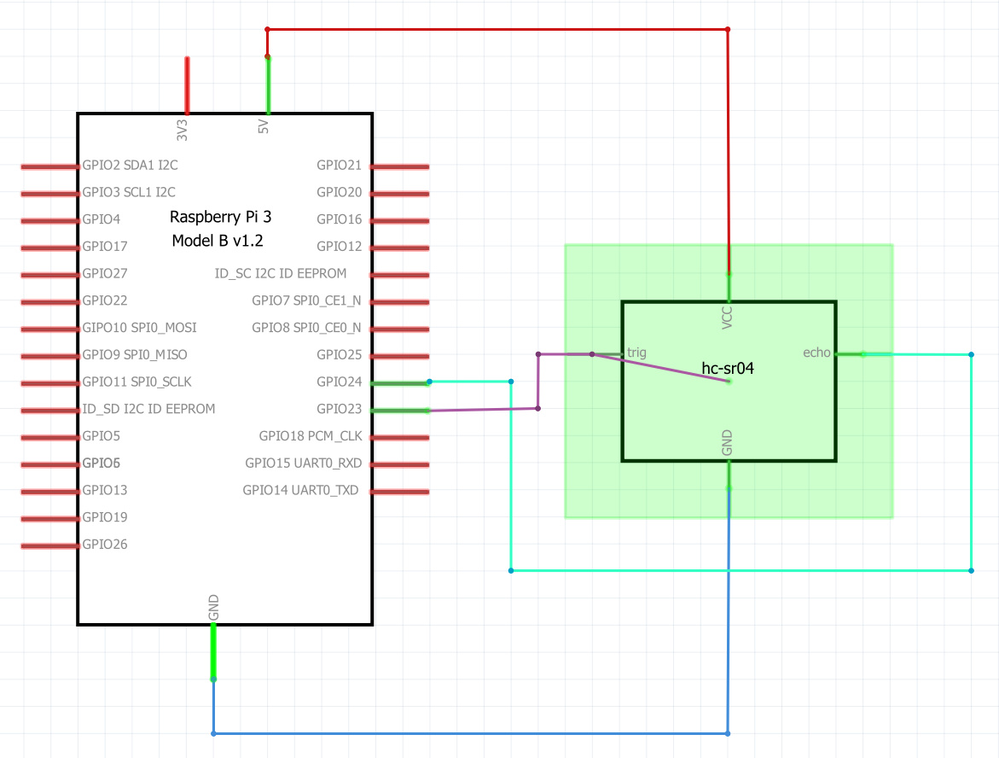

# Ultrasonic Sensor

The ultrasonic sensor is connected to two GPIO pins: a trigger pin and a echo pin. The VCC and GND are connected to the 5V and the ground

 

## Usage


To use the class, you first need to make an object with the class. The construction method takes two parameters: the pin for the trigger, and the pin for the echo.
This can be done  the following way:

```python
objectName = ultrasonicSensor(triggerPin, echoPin)
```

The setup method is called after making the object. This method sets the two given pins as in and outputs.

```python
objectName.setup()
```

When everything is set up, getting the distance is as easy as calling one method. The getDistance method.

```python
objectName.getDistance()
```

The method return the distance to the nearest object in centimeters. The range is 2cm to 4m.

When exiting the program, it is suggested to cleanup the gpio. There is an extra method (aside from the GPIO.cleanup() method) that sets the trigger to its 'off' state and frees the GPIO pins.

```python
objectName.cleanUp()
```

## Example script
```python
import time
import RPi.GPIO as GPIO
class ultrasonicSensor:
    
    def __init__(self, triggerPin, echoPin):
        self.trig = triggerPin
        self.echo = echoPin
    
    def setup(self):
        GPIO.setup(self.trig, GPIO.OUT)
        GPIO.setup(self.echo, GPIO.IN)

    def getDistance(self):
            GPIO.output(self.trig, True)
            time.sleep(0.00001)
            GPIO.output(self.trig, False)

            while GPIO.input(self.echo)==0:
                pulse_start = time.time()

            while GPIO.input(self.echo)==1:
                pulse_end = time.time()

            pulse_duration = pulse_end - pulse_start

            distance = pulse_duration * 17150
            distance = round(distance, 2)

            return distance
        
    def cleanup(self):
        GPIO.output(self.trig, False)
        GPIO.cleanup()


if __name__ == '__main__':

    GPIO.setmode(GPIO.BCM)

    sensor = ultrasonicSensor(13, 6)
    sensor.setup()

    while True:
        distance = sensor.getDistance()
        print(distance)
        time.sleep(1)
```