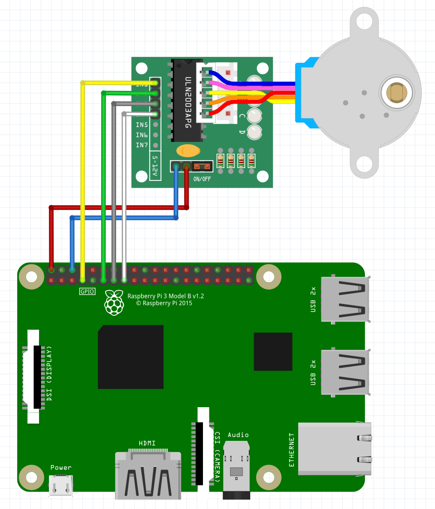
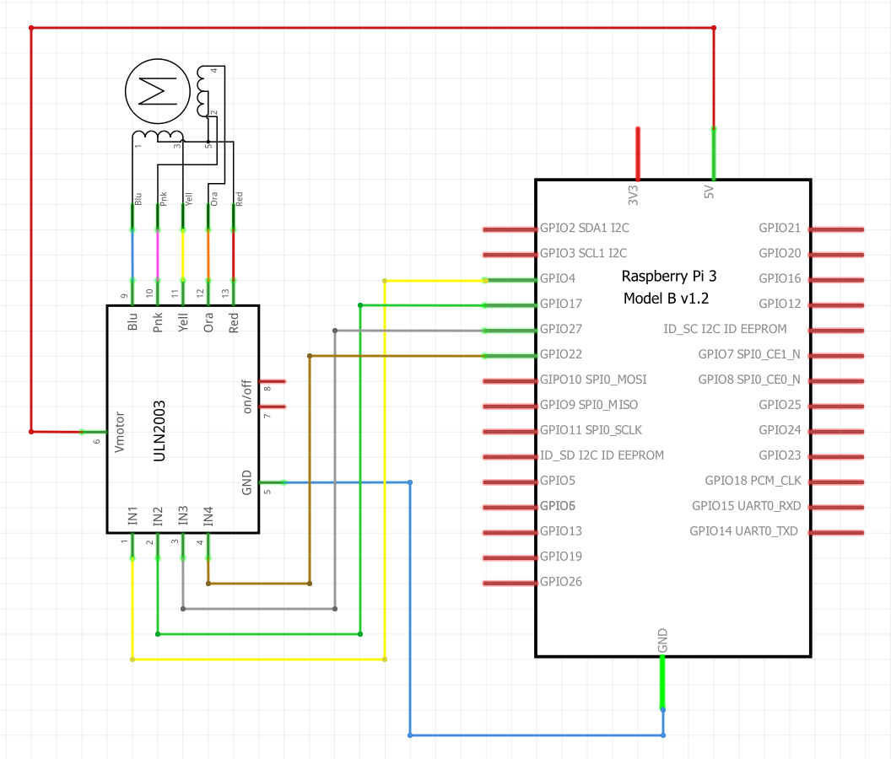

# Fish Feeder Stepper Motor

 

## Usage


To use the class, you first need to make an object with the class. The construction method takes one parameter: the four pins that connect to the input of the drivers in a array. The array should be a normal integer array.

```python
objectName = fishFeederMotor(pins)
```

The class has a few setters. The attributes that can be set are: StepSize (step size in degrees) and the FeederHoleAmount (the amount of holes in the feeder). If the amount of holes in the feeder is set, the method will calculate the amount of degrees per step automatically.

```python
objectName.setStepSize()
objectName.setFeederHoleAmount()
```

To rotate to the next hole, simply use the method rotate(). The method takes one parameter, either "cw" (clockwise) or "ccw" (counter clockwise). 

```python
objectName.rotate(direction)
```

There is also a way to just rotate one step. For this however you need to keep an extra variable yourself: the step on wich your on. Easiest way to do this is just using for loops of range 8.

```python
objectName.rotateOneStep(direction, step)
```

## Example script
```python
import RPi.GPIO as GPIO
import time

class fishFeederMotor:
    
    pins = []
    currentRotation = 0 # Rotation in steps
    stepSize = 36 # Step size in degrees
    stepSequence = [
        [False, True, True, True], 
        [False, False, True, True], 
        [True, False, True, True], 
        [True, False, False, True], 
        [True, True, False, True], 
        [True, True, False, False], 
        [True, True, True, False], 
        [False, True, True, False]
    ]
    stepSequenceStep = 0
    oneRevolution = 4076
    degreePerStep = 360 / oneRevolution

    def __init__(self, pinArray):
        self.pins = pinArray

    def setup(self):
        GPIO.setup(self.pins, GPIO.OUT)

    def setStepSize(self, stepSize):
        self.stepSize = stepSize

    def setFeederHoleAmount(self, amount):
        self.stepSize = 360 / amount

    def getCurrentRotation(self):
        return self.currentRotation

    def getCurrentDegrees(self):
        return self.currentRotation * self.degreePerStep

    def rotateOneStep(self, direction, step):

        if direction == "cw":
            GPIO.output(self.pins, self.stepSequence[step%8])

        elif direction == "ccw":
            GPIO.output(self.pins, self.stepSequence[7-(step%8)])


    def rotate(self, direction):

        stepsToRotate = int(self.stepSize // self.degreePerStep)
        
        if direction == "cw":
            for i in range(0, stepsToRotate):
                self.rotateOneStep("cw", i)
                time.sleep(0.002)

        if direction == "ccw":
            for i in range(0, stepsToRotate):
                self.rotateOneStep("ccw", i)
                time.sleep(0.002)

    def cleanUp(self):
        GPIO.output(pins, False)


if __name__ == "__main__":
    try:
        GPIO.setmode(GPIO.BCM)

        pins = [2, 3, 4, 17]
        stepperMotor = fishFeederMotor(pins)
        stepperMotor.setup()
        stepperMotor.setFeederHoleAmount(10)


        stepperMotor.rotate("ccw")
        time.sleep(1)
        stepperMotor.rotate("cw")
        time.sleep(1)


    except KeyboardInterrupt:
        stepperMotor.cleanUp()
        print("\nProgram stopped by user")
    stepperMotor.cleanUp()
```