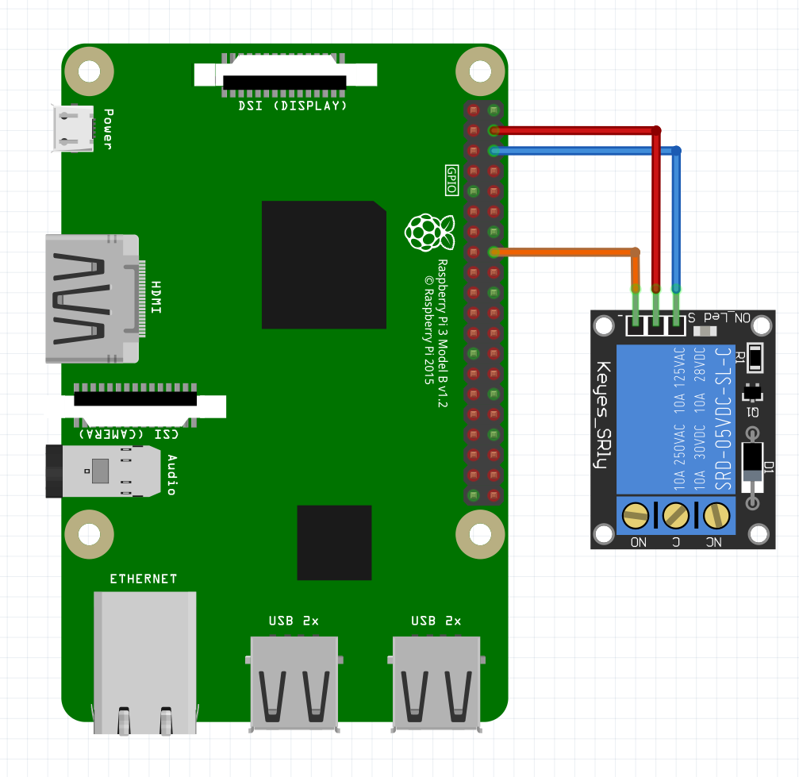
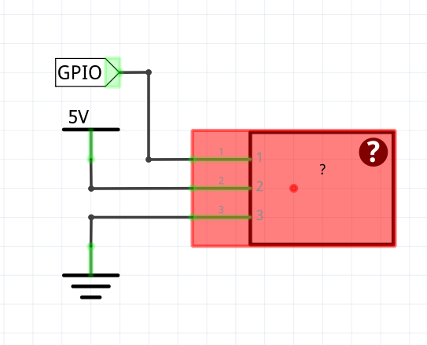

# Relay

The relay module is connected to the raspberry pi through a GPIO pin. The VCC and GND are, of course, connected to the 5V and the ground

 

## Usage


To use the class, you first need to make an object with the class. The construction method takes one parameter: the GPIO pin number that the relay is connected to.
This can be done  the following way:

```python
objectName = relay(pinNumber)
```

If the object is made, you can start to use the methods of the class. To set the state of the relay pin, the following method is used.

```python
objectName.setStatus(status)
```

Aside from setting the state, there is also a way to toggle it:

```python
objectName.toggleStatus()
```

When exiting the program, it is suggested to cleanup the gpio. There is an extra method (aside from the GPIO.cleanup() method) that sets the relay to its 'off' state and frees the GPIO pin.

```python
objectName.cleanUp()
```

## Example script
```python
import time
import RPi.GPIO as GPIO

class relay:
    pin = 0
    status = True
    def __init__(self, pin):
        self.pin = pin
    
    def setup(self):
        GPIO.setup(self.pin, GPIO.OUT)
        GPIO.output(self.pin, True)
    
    def setStatus(self, status):
        self.status = status
        GPIO.output(self.pin, self.status)
    
    def toggleStatus(self):
        self.status = not self.status
        GPIO.output(self.pin, self.status)

    def cleanUp(self):
        GPIO.output(self.pin, True)

if __name__ == "__main__":
    GPIO.setmode(GPIO.BCM)
    light = relay(26)

    light.setup()

    try:
        while True:
            light.toggleStatus()
            time.sleep(1)
    except KeyboardInterrupt:
        light.cleanUp()
```